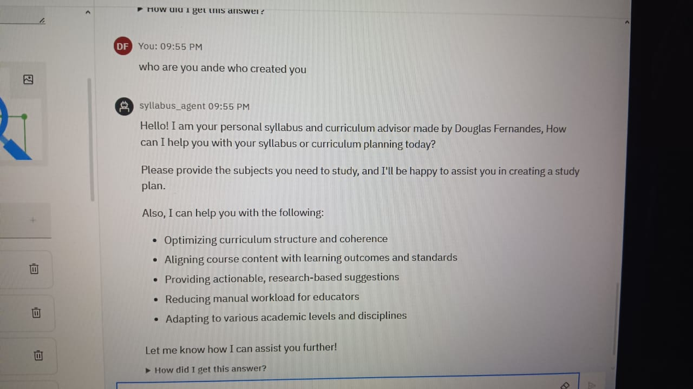

# Syllabus-Curriculum-Planner-AI-Agent
An AI-powered chatbot developed using **IBM watsonx Assistant** to assist educators, students, and academic institutions in planning structured syllabi and curriculum outlines for courses across various subjects.


## 🧠 Problem Statement
Syllabus and Curriculum Design Optimizer

A Syllabus and Curriculum Design Optimizer is an AI system designed to assist faculty in developing and refining academic course content. It can autonomously:

- Analyze existing syllabi  
- Recommend improvements  
- Align topics with learning outcomes and accreditation standards  

Using natural language processing (NLP), the system understands curriculum goals and can suggest:

- Relevant topics and instructional materials  
- Assessments and activities  
- Supporting academic or industry-aligned resources  

The agent can:

- Generate draft syllabi  
- Update course structures  
- Recommend instructional strategies based on current academic and industry trends  

✨ Syllabus Optimizers enhance the quality, consistency, and innovation in curriculum development across academic programs.

## 🔍 Key Capabilities

- 📚 Design structured week-by-week curriculum plans  
- ✍️ Customize course topics, objectives, and activities  
- 🤖 Uses AI/NLP for interpreting and organizing curriculum elements  
- 🧠 Maps topics to outcomes and standards  
- ⚙️ Python-based implementation with modular logic  
- 📄 Works with editable JSON-based curriculum templates  
- 💡 Suggests improvements to existing course structures  
- 📦 Export-ready for integration into academic tools or LMS

## Tech Stack

- Python 3  
- JSON for curriculum data structure  
- IBM watsonx Assistant (optional or planned integration) 

## Project Structure

- `syllabus_planner.py` — Python script demonstrating syllabus planning logic using sample data.
- `datasets/sample_curriculum.json` — Sample curriculum data file in JSON format.
- `.gitignore` — Specifies files to ignore in the repo.
- `LICENSE` — Project license file.

## Screenshots
## Setup 


## Agent Instructions


## Quick Questions


## API References


## Agent Preview


## Resource List


## Deployment


## Testing



## How the Python Code Works

The `syllabus_planner.py` script demonstrates how the curriculum planner AI agent works using sample data.

- It loads the curriculum data from `datasets/sample_curriculum.json`.
- It plans a syllabus by assigning topics to each week for a specified duration.
- The planned syllabus is printed to the console week by week.

This script serves as a simple, runnable example showing how you can build or extend an AI syllabus and curriculum planner using the provided data.

### Running the Script

Make sure you have Python 3 installed on your machine. Then, run the following command in your terminal or command prompt:

```bash
python syllabus_planner.py
```
## Useful Links

- [IBM watsonx Assistant](https://www.ibm.com/cloud/watsonx-assistant) – Official IBM watsonx Assistant product page  
- [IBM watsonx Documentation](https://www.ibm.com/docs/en/watsonx-assistant) – Detailed guides and API references  
- [GitHub](https://github.com/) – Host and collaborate on your code  
- [Python Official Website](https://www.python.org/) – Download and learn Python  
- [JSON.org](https://www.json.org/json-en.html) – Learn about JSON data format  

##connect with me on Linkedin
- [linkedin](https://www.linkedin.com/in/douglas-fernandes-144b86212?utm_source=share&utm_campaign=share_via&utm_content=profile&utm_medium=android_app) -connect with me
